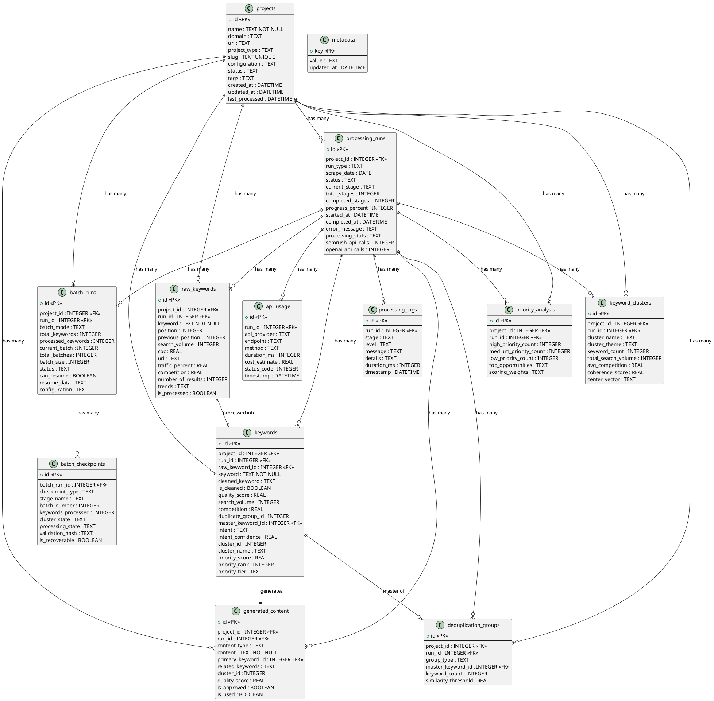

# Database Module Documentation

SQLite-based data layer for keyword clustering with 13 interconnected tables, batch processing, and transaction safety.

## Database Architecture Overview



## Database Location & Safety
- **File**: `data/keywords-cluster.db` (18MB+ active)
- **Mode**: SQLite WAL (write-ahead logging)
- **Safety**: Foreign key constraints, ACID transactions

## Core Components

- **connection.js** - SQLite connection with WAL mode and foreign keys
- **schema.js** - 13 tables, 20+ indexes, foreign key constraints
- **models/** - Base CRUD + specialized models (Project, Keyword, ProcessingRun, etc.)
- **migration.js** - CSV import/export and legacy data migration

## Essential Usage

```javascript
// Initialize
const db = await getDatabase();
const projectModel = new ProjectModel(db);

// Safe operations with transactions
projectModel.transaction(() => {
  const project = projectModel.create(projectData);
  const run = processingRunModel.startRun(project.id);
  return { project, run };
});
```

## Critical Safety Rules

⚠️ **Always use model layer** - Never raw SQL
⚠️ **Wrap multi-operations in transactions** - Use `model.transaction()`
⚠️ **Foreign key cascades** - Deletion removes ALL related data
⚠️ **Backup before destructive ops** - Database has 18MB+ of data